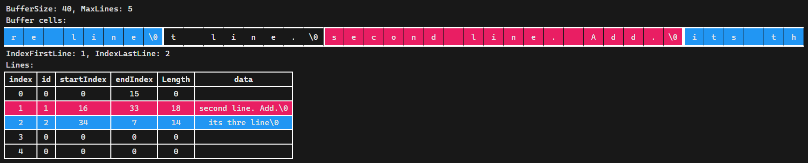
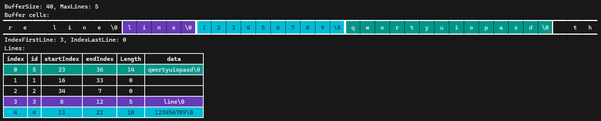

# Flexible Circular Buffer

## Overview

This is a flexible circular buffer implementation that allows storing arrays of variable length. Unlike a traditional circular buffer, it can accommodate arrays of different sizes, such as text strings. When the buffer is full, new arrays overwrite the old ones, similar to a standard circular buffer.

Usage Example

```C++
#include "FlexibleCircularBuffer.h"

// Initialize the buffer with a capacity for 40 characters and a maximum of 5 lines.
static FlexibleCircularBuffer<char> logBuffer = FlexibleCircularBuffer<char>(40, 5);

int main()
{
    // Example of writing lines to the buffer.
    const char* line1 = "its first line.";
    logBuffer.WriteLine(line1, (uint16_t)strlen(line1) + 1);

    const char* line2 = "second line";
    uint32_t id = logBuffer.WriteLine(line2, (uint16_t)strlen(line2) + 1);

    // Example of reading and printing lines from the buffer.
    BufferLine<char>* line = logBuffer.ReadFirst();
    while (line != nullptr)
    {
        std::cout << line->GetData() << "\n";
        line = logBuffer.FreeAndReadNext(line);
    }
}
```

## Methods

### `WriteLine`
Writes a line to the buffer. The first argument is the line itself, and the second argument is its length. Returns a unique ID for the line. If the method returns 0, it means the line exceeds half of the buffer's capacity.

### `WriteToLastLine`
Appends data to the end of the last line. The first argument is the identifier of the last row, and the second and third are the data and its length. Returns 0 if there is an error, the buffer is half full, or the line ID does not match the last valid line ID.

### `ReadFirst`
Reads and returns a pointer to the first line in the buffer as a `BufferLine<T>` structure, where T is the data type. If buffer is empty returns nullptr.

### `ReadNext`
Takes the ID of a line and returns a pointer to the next line in the buffer. Returns nullptr if there is no next line.

### `ReadLast`
Reads and returns a pointer to the last line in the buffer as a `BufferLine<T>` structure. If buffer is empty returns nullptr.

### `FreeAndReadNext`
Frees the current line's resources by calling its destructor and returns a pointer to the next line in the buffer. Useful for iterating through the buffer.

## Notes

* The `BufferLine<T>` structure requires manual cleanup after use, typically through its destructor.
* When working with text, consider the null-terminator when specifying the length.
* If an array occupies more than half of the buffer, the WriteLine method returns 0.
* If the array takes up more than half of the buffer, the WriteLine (WriteToLastLine) method fails and returns 0.

Feel free to customize the buffer for different data types by changing the template parameter during initialization.

# An example with an explanation

Add SnapshotToFile method.

```C++
#define DebugMode_FlexibleCircularBuffer
```

### `SnapshotToFile`
The SnapshotToFile method is designed for debugging purposes, providing a mechanism to generate an HTML page that visualizes the internal state of the buffer. This visualization includes information about which cells in the buffer are occupied and the content of each line.

Parameters:
1. outputPath: The path to the file where the generated HTML page will be saved.

2. firstHtmlPath: The path to the HTML template file "debug-files/first.html"

3. lastHtmlPath: The path to the HTML template file "debug-files/last.html"

## Code

```C++
#include <iostream>

#define DebugMode_FlexibleCircularBuffer

#include "FlexibleCircularBuffer.h"

static FlexibleCircularBuffer<char> logBuffer = FlexibleCircularBuffer<char>(40, 5);

int main()
{
    const char* line1 = "its first line.";

    logBuffer.WriteLine(line1, (uint16_t)strlen(line1) + 1);

    logBuffer.SnapshotToFile("1.html", "first.html", "last.html");
```

1.html :


```C++
    const char* line2 = "second line";
    uint32_t id = logBuffer.WriteLine(line2, (uint16_t)strlen(line2) + 1);

    logBuffer.SnapshotToFile("2.html", "first.html", "last.html");
```

2.html :


```C++
    const char* line3 = ". Add.";
    logBuffer.WriteToLastLine(id, line3, (uint16_t)strlen(line3) + 1);

    logBuffer.SnapshotToFile("3.html", "first.html", "last.html");
```

3.html :


```C++
    const char* line4 = "its thre line";
    id = logBuffer.WriteLine(line4, (uint16_t)strlen(line4) + 1);
    logBuffer.SnapshotToFile("4.html", "first.html", "last.html");
```
4.html :


```C++
    const char* line5 = "line";
    id = logBuffer.WriteLine(line5, (uint16_t)strlen(line5) + 1);
    logBuffer.SnapshotToFile("5.html", "first.html", "last.html");
```
5.html :


```C++
    const char* line6 = "123456789";
    id = logBuffer.WriteLine(line6, (uint16_t)strlen(line6) + 1);
    logBuffer.SnapshotToFile("6.html", "first.html", "last.html");
```
6.html :


```C++
    const char* line7 = "qwertyuiopasd";
    id = logBuffer.WriteLine(line7, (uint16_t)strlen(line7) + 1);
    logBuffer.SnapshotToFile("7.html", "first.html", "last.html");
```
7.html :


```C++
    BufferLine<char>* line = logBuffer.ReadFirst();
    while (line != nullptr)
    {
        std::cout << line->GetData() << "\n";
        line = logBuffer.FreeAndReadNext(line);
    }
}
```
Output:
```
line
123456789
qwertyuiopasd
```
